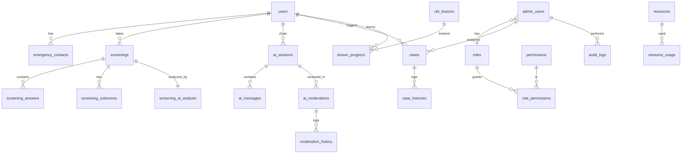

# MindCare AI — Phân tích & Thiết kế Backend / Database (Admin)

> Tài liệu thiết kế backend cho 9 màn hình quản trị của MindCare AI.
> Nguồn: 9 screen admin + bản mô tả chức năng. Lĩnh vực: sức khỏe tinh thần → ưu tiên bảo mật PII, audit log, phân quyền, và **không cho AI tự chẩn đoán**.

---

## 0. Nguyên tắc thiết kế xuyên suốt (đặc thù sức khỏe tinh thần)

| Nguyên tắc | Áp dụng trong thiết kế |
|---|---|
| **PII tối thiểu & mã hóa** | email, SĐT, địa chỉ, liên hệ khẩn cấp lưu mã hóa (at-rest); có cờ `privacy_masking_enabled` để ẩn hiển thị khi không đủ quyền (thấy ở màn Cài đặt). |
| **Audit mọi thao tác admin** | Mọi hành động ghi/sửa/xóa/duyệt/export đều sinh 1 dòng `audit_logs` (before/after data). Đây là yêu cầu pháp lý, không phải tùy chọn. |
| **RBAC chặt** | 4 vai trò trong ảnh: Quản trị viên (toàn quyền), Quản lý, Chuyên viên, Đối tác (chỉ xem báo cáo). Permission tách riêng khỏi role. |
| **AI không chẩn đoán** | Mọi phản hồi AI phải qua `ai_moderations` với checklist 5 tiêu chí (đồng cảm / không chẩn đoán / dựa trên CBT / an toàn / khuyến nghị gặp chuyên gia) trước khi coi là "đã duyệt". |
| **Crisis escalation** | `risk_level = crisis` kích hoạt luồng: gọi hotline → thông báo chuyên viên → gửi email (cấu hình ở Cài đặt). Lưu lại trong `case_histories`. |
| **Tách 4 nhóm dữ liệu** | (1) Người dùng, (2) Sức khỏe/sàng lọc, (3) AI, (4) Quản trị/hệ thống — phản ánh trong cách nhóm bảng bên dưới. |
| **Data retention** | Cấu hình giữ backup (30 ngày ở ảnh) + chính sách lưu/xóa dữ liệu sàng lọc theo quy định. |

---

## 1. Bảng phân tích theo màn hình

### 1.1. Báo cáo & phân tích (`Image: Báo cáo & phân tích`)

| Chức năng | Dữ liệu chính | Bảng DB | API đề xuất |
|---|---|---|---|
| 4 thẻ KPI (tổng lượt sàng lọc, % rủi ro cao, thời gian xử lý TB, % duyệt AI) | aggregate metrics + so sánh kỳ trước | `screenings`, `cases`, `ai_moderations` (qua view/materialized) | `GET /admin/reports/summary?from&to` |
| Biểu đồ lượt sàng lọc theo ngày + đường TB 7 ngày | count theo ngày | `screenings` | `GET /admin/reports/screenings-by-day` |
| Phân bố mức độ rủi ro (donut) | count theo `risk_level` | `screenings` | `GET /admin/reports/risk-distribution` |
| Chủ đề phổ biến (bar) | count theo `topic` | `screenings` | `GET /admin/reports/topics` |
| Tỷ lệ xử lý ca theo trạng thái (stacked) | count theo `case_status`/ngày | `cases` | `GET /admin/reports/case-status` |
| Bảng tổng hợp theo tháng + cột xu hướng | rollup theo tháng | `report_monthly_rollups` (materialized) | `GET /admin/reports/monthly` |
| Nhận định & khuyến nghị | text rule-based/AI sinh ra | `report_insights` | `GET /admin/reports/insights` |
| Bộ lọc theo ngày + Xuất báo cáo | range filter, file export | `report_exports` | `GET /admin/reports/export?from&to&format` |

### 1.2. Ca cần xử lý (`Image: Ca cần xử lý`)

| Chức năng | Dữ liệu chính | Bảng DB | API đề xuất |
|---|---|---|---|
| 4 thẻ trạng thái (Mới / Khẩn cấp / Đang theo dõi / Đã đóng) | count theo `case_status`, `priority` | `cases` | `GET /admin/cases/stats` |
| Danh sách ca + lọc (ưu tiên, trạng thái, chuyên viên, thời gian) | case list | `cases` JOIN `users`, `admin_users` | `GET /admin/cases?priority&status&specialist&from&to` |
| Chi tiết ca: thông tin người dùng, tin nhắn, AI confidence, tín hiệu phát hiện, hành động đề xuất | full case | `cases`, `users`, `ai_messages`, `emergency_contacts` | `GET /admin/cases/:id` |
| Lịch sử xử lý | timeline | `case_histories` | `GET /admin/cases/:id/history` |
| Đánh dấu đã xem | status update | `cases` | `PATCH /admin/cases/:id` `{status:viewed}` |
| Giao chuyên viên | assign | `cases.assigned_specialist_id` | `POST /admin/cases/:id/assign` |
| Escalate | escalation + crisis flow | `cases`, `case_histories`, `notifications` | `POST /admin/cases/:id/escalate` |
| Đóng ca | close | `cases.closed_at` | `POST /admin/cases/:id/close` |
| Hỗ trợ khẩn cấp (hotline 111 / 1900 1009) | hotline cấu hình | `emergency_hotlines` | `GET /admin/hotlines` |

### 1.3. Kiểm duyệt nội dung AI (`Image: Kiểm duyệt nội dung AI`)

| Chức năng | Dữ liệu chính | Bảng DB | API đề xuất |
|---|---|---|---|
| 4 thẻ (Chờ duyệt / Đã duyệt hôm nay / Từ chối / Cần cải thiện) | count theo `moderation_status` | `ai_moderations` | `GET /admin/ai-moderations/stats` |
| Danh sách phiên cần duyệt + tab lọc + lọc theo mức rủi ro, loại phản hồi | list | `ai_moderations` JOIN `ai_sessions`, `users` | `GET /admin/ai-moderations?status&risk&type` |
| Chi tiết: nội dung người dùng + phản hồi AI + chủ đề + thời lượng phiên | message pair | `ai_messages`, `ai_sessions` | `GET /admin/ai-moderations/:id` |
| Checklist 5 tiêu chí (đồng cảm, không chẩn đoán, dựa CBT, an toàn, khuyến nghị gặp chuyên gia) | boolean flags | `ai_moderations` (cột checklist) | `PATCH /admin/ai-moderations/:id/checklist` |
| Duyệt / Từ chối / Gắn cờ cần cải thiện | status | `ai_moderations` | `POST /admin/ai-moderations/:id/{approve,reject,flag}` |
| Chỉnh sửa phản hồi AI | edited response | `ai_messages` (revision) | `POST /admin/ai-moderations/:id/edit` |
| Lịch sử kiểm duyệt | timeline | `moderation_history` | `GET /admin/ai-moderations/:id/history` |

### 1.4. Quản lý bài học CBT (`Image: Quản lý bài học CBT`)

| Chức năng | Dữ liệu chính | Bảng DB | API đề xuất |
|---|---|---|---|
| 4 thẻ (Tổng / Đang hoạt động / Bản nháp / Tỉ lệ hoàn thành TB) | count + avg | `cbt_lessons`, `lesson_progress` | `GET /admin/cbt-lessons/stats` |
| Danh sách + tìm kiếm + lọc (danh mục, cấp độ, trạng thái) + sắp xếp | list | `cbt_lessons` | `GET /admin/cbt-lessons?category&level&status&sort` |
| Thêm / Chỉnh sửa / Lưu nháp | CRUD | `cbt_lessons` | `POST /admin/cbt-lessons`, `PATCH /admin/cbt-lessons/:id` |
| Xuất bản | publish | `cbt_lessons.status,published_at` | `POST /admin/cbt-lessons/:id/publish` |
| Xem trước / Bài học được chọn (mục tiêu, tags) | detail | `cbt_lessons` | `GET /admin/cbt-lessons/:id` |
| Thống kê: tỉ lệ hoàn thành, bài học phổ biến | aggregate | `lesson_progress` | `GET /admin/cbt-lessons/analytics` |

### 1.5. Cài đặt hệ thống (`Image: Cài đặt hệ thống`)

| Chức năng | Dữ liệu chính | Bảng DB | API đề xuất |
|---|---|---|---|
| Cài đặt chung (tên, múi giờ, ngôn ngữ, định dạng ngày/giờ, cho phép đăng ký, xác minh email) | config | `system_settings` | `GET/PATCH /admin/settings/general` |
| Ngưỡng cảnh báo AI (Low/Moderate/High/Crisis: điểm 0–100, màu, hành động mặc định) | thresholds | `risk_thresholds` | `GET/PATCH /admin/settings/risk-thresholds` |
| Quy tắc kiểm duyệt AI (danh mục rủi ro → hành động) | rules | `moderation_rules` | `GET/PATCH /admin/settings/moderation-rules` |
| Vai trò & phân quyền (4 vai trò + số người + quản lý) | RBAC | `roles`, `permissions`, `role_permissions` | `GET/PATCH /admin/roles`, `GET /admin/permissions` |
| Quyền riêng tư & bảo mật (2FA, hết hạn phiên, chính sách mật khẩu, ẩn PII) | security config | `system_settings` | `GET/PATCH /admin/settings/security` |
| Thông báo (email hệ thống, in-app, báo cáo hằng ngày, email nhận) | notification config | `notification_settings` | `GET/PATCH /admin/settings/notifications` |
| Hotline khẩn cấp + quy trình escalation + email cảnh báo | hotline config | `emergency_hotlines`, `system_settings` | `GET/PATCH /admin/settings/hotlines` |
| Tích hợp (Email SMTP, SMS Gateway, GA4, SSO) | integration config | `integrations` | `GET/PATCH /admin/settings/integrations` |
| Sao lưu & khôi phục (tự động, giữ N ngày, sao lưu ngay, khôi phục) | backup config | `system_settings`, `backups` | `GET/PATCH /admin/settings/backup`, `POST /admin/backup/run`, `POST /admin/backup/restore` |

### 1.6. Quản lý người dùng (`Image: Quản lý người dùng`)

| Chức năng | Dữ liệu chính | Bảng DB | API đề xuất |
|---|---|---|---|
| 4 thẻ (Tổng / Đang hoạt động / Rủi ro cao / Chờ xử lý) | count theo `account_status`, `risk_level` | `users` | `GET /admin/users/stats` |
| Danh sách + tìm kiếm + lọc (mức rủi ro, trạng thái, nhóm) | list | `users` | `GET /admin/users?risk&status&group&q` |
| Thêm người dùng / Xuất dữ liệu | CRUD + export | `users`, `report_exports` | `POST /admin/users`, `GET /admin/users/export` |
| Hồ sơ: thông tin liên hệ, liên hệ khẩn cấp | detail | `users`, `emergency_contacts` | `GET /admin/users/:id` |
| Lịch sử sàng lọc gần đây | recent screenings | `screenings` | `GET /admin/users/:id/screenings` |
| Gán chuyên viên | assign | `users.assigned_specialist_id` | `POST /admin/users/:id/assign-specialist` |
| Xem trạng thái (hoạt động / tạm khóa / cần xử lý) | status | `users.account_status` | `PATCH /admin/users/:id` |

### 1.7. Nhật ký hệ thống (`Image: Nhật ký hệ thống`)

| Chức năng | Dữ liệu chính | Bảng DB | API đề xuất |
|---|---|---|---|
| 4 thẻ (Tổng sự kiện / Đăng nhập thất bại / Hành động quản trị / Export dữ liệu) | count theo `action_type`, `status` | `audit_logs` | `GET /admin/system-logs/stats` |
| Danh sách + lọc (thời gian, loại sự kiện, người thực hiện, mức độ) + tìm theo IP/đối tượng | list | `audit_logs` | `GET /admin/system-logs?from&to&type&actor&level&q` |
| Chi tiết: thời gian, Trace ID, IP, thiết bị, User Agent, phương thức, kết quả, thời gian xử lý | detail | `audit_logs` | `GET /admin/system-logs/:id` |
| Thay đổi dữ liệu (trước / sau) | before/after JSON | `audit_logs.before_data,after_data` | (trong detail) |
| Sự kiện nghiêm trọng gần đây | filter level=critical | `audit_logs` | `GET /admin/system-logs/critical` |

### 1.8. Quản lý sàng lọc (`Image: Quản lý sàng lọc`)

| Chức năng | Dữ liệu chính | Bảng DB | API đề xuất |
|---|---|---|---|
| 4 thẻ (Số lượt hôm nay / Tỉ lệ hoàn thành / Rủi ro cao / Điểm TB) | aggregate | `screenings` | `GET /admin/screenings/stats` |
| Danh sách + lọc (thời gian, rủi ro, trạng thái) + tìm ID/người dùng | list | `screenings` JOIN `users`, `questionnaires` | `GET /admin/screenings?from&to&risk&status&q` |
| Chi tiết phiên: bộ câu hỏi (PHQ-9/GAD-7/DASS-21), câu trả lời tiêu biểu, điểm số | detail | `screenings`, `screening_answers`, `questionnaires` | `GET /admin/screenings/:id` |
| Phân tích AI (nguy cơ, cảm xúc chính) | ai analysis | `screening_ai_analysis` | `GET /admin/screenings/:id/ai-analysis` |
| Phân tích điểm theo nhóm (trầm cảm / lo âu / căng thẳng) | subscores | `screening_subscores` | (trong detail) |
| Thêm ghi chú / Xuất dữ liệu | note + export | `screening_notes`, `report_exports` | `POST /admin/screenings/:id/notes`, `GET /admin/screenings/export` |
| Biểu đồ phân bố rủi ro + tỉ lệ hoàn thành theo ngày | aggregate | `screenings` | `GET /admin/screenings/charts` |

### 1.9. Quản lý tài nguyên (`Image: Quản lý tài nguyên`)

| Chức năng | Dữ liệu chính | Bảng DB | API đề xuất |
|---|---|---|---|
| 4 thẻ (Tổng / Khẩn cấp / Đã xuất bản / Cần cập nhật) | count theo `status` | `resources` | `GET /admin/resources/stats` |
| Danh sách + tab lọc loại (Bài viết/Audio/Video/Công cụ CBT/Khẩn cấp) + tìm kiếm + lọc danh mục | list | `resources` | `GET /admin/resources?type&category&q` |
| Thêm / Chỉnh sửa / Xuất bản | CRUD + publish | `resources` | `POST /admin/resources`, `PATCH /admin/resources/:id`, `POST /admin/resources/:id/publish` |
| Chi tiết: ID, ngày tạo, cập nhật, người phụ trách, thẻ | detail | `resources`, `admin_users` | `GET /admin/resources/:id` |
| Số lượt sử dụng | usage count | `resource_usage` | `GET /admin/resources/:id/usage` |
| Quản lý trạng thái (đã xuất bản / nháp / cần cập nhật / khẩn cấp) | status | `resources.status` | `PATCH /admin/resources/:id` |

---

## 2. Schema database tổng thể

Ký hiệu: `PK` khóa chính, `FK→` khóa ngoại, `🔒` trường PII cần mã hóa/masking, `idx` nên đánh index.

### Nhóm 1 — Dữ liệu người dùng

**users**
`id PK` · `full_name 🔒` · `email 🔒 idx` · `phone 🔒` · `gender` · `date_of_birth 🔒` · `address 🔒` · `user_group` · `account_status (active|suspended|pending) idx` · `risk_level (low|moderate|high|crisis) idx` *(denormalized hiện tại)* · `latest_screening_id FK→screenings` · `assigned_specialist_id FK→admin_users` · `created_at` · `updated_at`

**emergency_contacts**
`id PK` · `user_id FK→users idx` · `name 🔒` · `phone 🔒` · `relationship`

### Nhóm 2 — Dữ liệu sức khỏe / sàng lọc

**questionnaires**
`id PK` · `type (PHQ-9|GAD-7|DASS-21)` · `version` · `questions JSONB` · `scoring_rule JSONB` · `is_active`

**screenings**
`id PK` · `user_id FK→users idx` · `questionnaire_id FK→questionnaires` · `total_score` · `sub_scores JSONB` *(hoặc bảng riêng bên dưới)* · `risk_level idx` · `risk_score` · `topic idx` · `status (completed|incomplete)` · `processing_time` · `started_at` · `completed_at idx` · `created_by`

**screening_answers**
`id PK` · `screening_id FK→screenings idx` · `question_id` · `answer_value` · `answer_text`

**screening_subscores**
`id PK` · `screening_id FK→screenings` · `dimension (depression|anxiety|stress)` · `score` · `max_score`

**screening_ai_analysis**
`id PK` · `screening_id FK→screenings` · `risk_prediction` · `main_emotions JSONB` · `analysis_text` · `model_name` · `confidence`

**screening_notes**
`id PK` · `screening_id FK→screenings` · `author_id FK→admin_users` · `note` · `created_at`

### Nhóm 3 — Dữ liệu AI

**ai_sessions**
`id PK` · `user_id FK→users idx` · `topic` · `model_name` · `duration_minutes` · `started_at` · `ended_at`

**ai_messages**
`id PK` · `session_id FK→ai_sessions idx` · `sender (user|ai)` · `content` · `risk_level` · `ai_confidence` · `parent_message_id FK→ai_messages` *(ghép cặp user↔ai)* · `revision_of FK→ai_messages` *(bản chỉnh sửa)* · `created_at`

**ai_moderations**
`id PK` · `session_id FK→ai_sessions idx` · `user_message_id FK→ai_messages` · `ai_message_id FK→ai_messages` · `risk_level` · `moderation_status (pending|approved|rejected|needs_improvement) idx` · `checklist_empathy BOOL` · `checklist_no_diagnosis BOOL` · `checklist_cbt_based BOOL` · `checklist_safe BOOL` · `checklist_referral BOOL` · `reviewer_id FK→admin_users` · `reviewer_note` · `reviewed_at`

**moderation_history**
`id PK` · `moderation_id FK→ai_moderations idx` · `action` · `actor_id FK→admin_users` · `note` · `created_at`

### Nhóm 4 — Ca & nội dung

**cases**
`id PK` · `user_id FK→users idx` · `screening_id FK→screenings` · `source_message_id FK→ai_messages` · `detected_signal` · `priority (low|medium|high|crisis) idx` · `risk_level idx` · `ai_confidence` · `suggested_actions JSONB` · `assigned_specialist_id FK→admin_users idx` · `case_status (new|viewed|monitoring|closed) idx` · `created_at` · `updated_at` · `closed_at`

**case_histories**
`id PK` · `case_id FK→cases idx` · `action (created|viewed|assigned|escalated|closed|note)` · `actor_id FK→admin_users` · `note` · `created_at`

**cbt_lessons**
`id PK` · `title` · `description` · `content` · `thumbnail_url` · `category idx` · `level (basic|intermediate|advanced)` · `duration_minutes` · `status (draft|published|archived) idx` · `tags JSONB` · `learning_objectives JSONB` · `view_count` · `created_by FK→admin_users` · `updated_by FK→admin_users` · `created_at` · `updated_at` · `published_at`

**lesson_progress**
`id PK` · `lesson_id FK→cbt_lessons idx` · `user_id FK→users idx` · `status (started|completed)` · `progress_percent` · `completed_at`

**resources**
`id PK` · `title` · `description` · `type (article|audio|video|cbt_tool|emergency) idx` · `category` · `content` · `file_url` · `thumbnail_url` · `duration` · `status (draft|published|needs_update|emergency) idx` · `tags JSONB` · `responsible_admin_id FK→admin_users` · `created_at` · `updated_at` · `last_reviewed_at`

**resource_usage**
`id PK` · `resource_id FK→resources idx` · `user_id FK→users` · `used_at`

### Nhóm 5 — Quản trị / bảo mật / hệ thống

**admin_users** *(nhân sự: quản trị viên, quản lý, chuyên viên, đối tác)*
`id PK` · `full_name` · `email 🔒 idx` · `password_hash` · `role_id FK→roles` · `status` · `two_factor_enabled BOOL` · `last_login_at` · `created_at`

**roles** · `id PK` · `name` · `scope (full|management|professional|report_only)` · `description`
**permissions** · `id PK` · `key idx` · `description`
**role_permissions** · `role_id FK→roles` · `permission_id FK→permissions` *(PK kép)*

**audit_logs** *(append-only)*
`id PK` · `trace_id idx` · `actor_id FK→admin_users idx` · `actor_role` · `action_type idx` · `target_type` · `target_id idx` · `ip_address idx` · `device` · `browser` · `user_agent` · `request_method` · `request_path` · `response_code` · `processing_time` · `status (success|failed|warning) idx` · `before_data JSONB` · `after_data JSONB` · `created_at idx`

**system_settings** · `key PK` · `value JSONB` · `updated_by FK→admin_users` · `updated_at` *(general, security, password_policy, privacy...)*
**risk_thresholds** · `id PK` · `level (low|moderate|high|crisis)` · `score_min` · `score_max` · `color` · `default_action`
**moderation_rules** · `id PK` · `risk_category` · `action` · `is_active`
**notification_settings** · `id PK` · `channel (email|in_app|specialist|daily_report)` · `enabled BOOL` · `config JSONB`
**emergency_hotlines** · `id PK` · `name` · `phone_main` · `phone_backup` · `type (national|crisis)` · `available_hours` · `escalation_flow JSONB`
**integrations** · `id PK` · `name (smtp|sms|ga4|sso)` · `status (connected|disconnected)` · `config JSONB`
**backups** · `id PK` · `type (auto|manual)` · `file_url` · `size` · `created_at` · `retention_until`
**report_exports** · `id PK` · `report_type` · `params JSONB` · `file_url` · `requested_by FK→admin_users` · `created_at`
**report_monthly_rollups** *(materialized)* · `month` · `total_screenings` · `high_risk_rate` · `avg_processing_time` · `ai_approval_rate` · `crisis_count`

### Quan hệ cốt lõi (mermaid)

---

## 3. Thứ tự ưu tiên triển khai backend

**Phase 0 — Nền tảng bảo mật (làm trước tiên, không bỏ qua)**
`admin_users` · `roles` · `permissions` · `role_permissions` · auth + 2FA + session policy · `audit_logs` (middleware ghi log toàn cục) · `system_settings`.
→ Lý do: lĩnh vực sức khỏe tinh thần bắt buộc phân quyền + audit ngay từ đầu; nếu thêm sau sẽ phải retrofit toàn bộ.

**Phase 1 — Domain người dùng**
`users` · `emergency_contacts` · masking PII. API: list/detail/CRUD/assign-specialist/export.

**Phase 2 — Engine sàng lọc (trái tim dữ liệu)**
`questionnaires` · `screenings` · `screening_answers` · `screening_subscores` · `screening_ai_analysis` · `screening_notes` · `risk_thresholds`.
→ Đây là nguồn sinh ra `risk_level`, `topic`, điểm số — feed cho Cases và Báo cáo.

**Phase 3 — AI & kiểm duyệt**
`ai_sessions` · `ai_messages` · `ai_moderations` (checklist 5 tiêu chí) · `moderation_history` · `moderation_rules`.
→ Cổng "AI không chẩn đoán" phải hoạt động trước khi mở rộng tương tác AI cho người dùng.

**Phase 4 — Ca cần xử lý**
`cases` · `case_histories` · luồng escalate/crisis · `emergency_hotlines` · `notification_settings`.
→ Phụ thuộc tín hiệu từ Phase 2 & 3.

**Phase 5 — Nội dung**
`cbt_lessons` · `lesson_progress` · `resources` · `resource_usage`.
→ Độc lập, có thể làm song song khi đội lớn.

**Phase 6 — Báo cáo & vận hành**
`report_monthly_rollups` (materialized view/cron) · `report_exports` · `report_insights` · `integrations` (SMTP/SMS/GA4/SSO) · `backups`.
→ Read-heavy, tổng hợp từ tất cả domain trên → làm cuối.

---

## 4. Lưu ý quan trọng khi build

- **Index nóng:** `screenings(completed_at, risk_level)`, `cases(case_status, priority, assigned_specialist_id)`, `ai_moderations(moderation_status)`, `audit_logs(created_at, actor_id, target_id)` — đây là các cột lọc/sort thường xuyên trên UI.
- **Materialized view cho Báo cáo:** không query realtime trên `screenings`/`cases` cho dashboard; refresh theo cron (vd mỗi giờ) qua `report_monthly_rollups`.
- **`risk_level` trên `users`** là giá trị denormalized (lấy từ lần screening mới nhất) để list nhanh — cần cập nhật khi có screening mới.
- **Soft delete + audit** cho mọi bảng PII; không xóa cứng dữ liệu người dùng.
- **`audit_logs` append-only**, không cho UPDATE/DELETE; cân nhắc bảng riêng/partition theo tháng vì volume lớn (12.842 sự kiện/ngày trong ảnh).
- **AI confidence + checklist** nên là điều kiện bắt buộc: phản hồi chỉ "approved" khi đủ 5 tiêu chí; thiếu "khuyến nghị gặp chuyên gia" → tự gắn cờ `needs_improvement` (đúng như cảnh báo vàng trong ảnh Kiểm duyệt AI).
