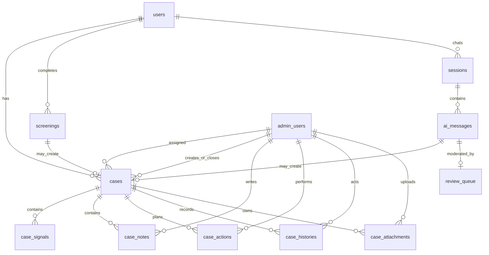
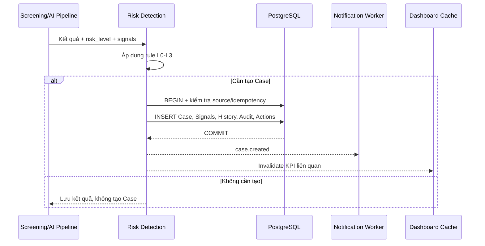
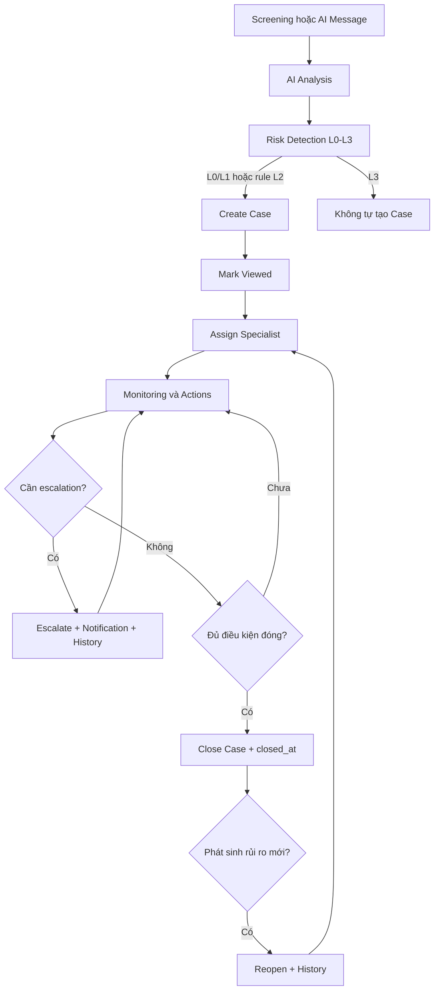
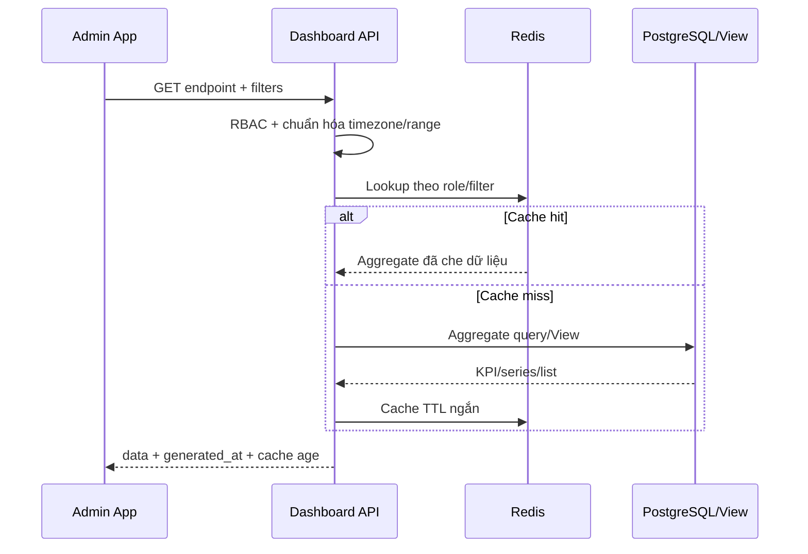

# MindCare AI — Thiết kế Backend/Database cho Dashboard và Case Management

## 1. Phân tích yêu cầu

### 1.1. Phạm vi

Tài liệu này chỉ thiết kế hai module còn thiếu:

1. Dashboard (Tổng quan).
2. Case Management (Ca cần xử lý).

Thiết kế kế thừa kiến trúc FastAPI + SQLAlchemy + Alembic + PostgreSQL hiện tại, đồng thời dùng lại các miền dữ liệu đã có hoặc đã được thiết kế: `users`, `user_profiles`, `screenings`, `sessions`, `ai_messages`, `review_queue`, `moderation_reviews`, `admin_users`, `resources`, `lessons` và `audit_trail`.

Không tạo bảng dữ liệu riêng cho Dashboard. Dashboard là read model tổng hợp từ các module nguồn.

### 1.2. Kết quả phân tích ảnh `Ca.jpg`

Màn hình Case Management cần hỗ trợ:

- KPI: Ca mới, Khẩn cấp, Đang theo dõi, Đã đóng.
- Tìm kiếm theo người dùng/email/số điện thoại và lọc theo ưu tiên, trạng thái, chuyên viên, khoảng thời gian.
- Danh sách gồm: mã ca, người dùng, tín hiệu phát hiện, mức ưu tiên, thời gian, trạng thái, chuyên viên và hành động.
- Panel chi tiết gồm: hồ sơ người dùng, tin nhắn nguồn, AI confidence, mức rủi ro, danh sách tín hiệu, hành động đề xuất và lịch sử xử lý.
- Hành động: đánh dấu đã xem, giao chuyên viên, escalate, đóng ca và truy cập hỗ trợ khẩn cấp.

### 1.3. Quy ước dùng chung

- Risk chỉ dùng `L0`, `L1`, `L2`, `L3`; số càng nhỏ thì rủi ro càng cao.
- `priority` là độ ưu tiên vận hành của Case, khác với risk lâm sàng:
  - `critical`: xử lý ngay.
  - `high`: ưu tiên cao.
  - `medium`: ưu tiên trung bình.
  - `low`: ưu tiên thường.
- Nội dung tin nhắn, ghi chú, lý do đóng và metadata có PHI/PII phải mã hóa bằng cơ chế hiện tại.
- Mọi thay đổi Case phải tạo `case_histories` và `audit_trail` trong cùng transaction.

## 2. Kiến trúc tổng thể

```text
Users / Screenings / AI Messages
                │
                ▼
          Risk Detection
                │
                ▼
              Cases ───── Case Signals
                │  ├───── Case Notes
                │  ├───── Case Actions
                │  ├───── Case Attachments
                │  └───── Case Histories
                │
                ▼
      Dashboard Query Service
                │
       PostgreSQL views + Redis cache
                │
                ▼
           Admin Dashboard
```

### 2.1. Ranh giới module

- Case Management sở hữu `cases` và các bảng con `case_*`.
- User, Screening và AI Moderation vẫn là nguồn sự thật của dữ liệu gốc.
- Case chỉ lưu snapshot cần thiết để giữ đúng bối cảnh tại thời điểm phát hiện; không sao chép nội dung PII/PHI từ bảng nguồn.
- Dashboard chỉ đọc. Không được cập nhật dữ liệu nghiệp vụ qua API Dashboard.

## 3. Thiết kế Database

### 3.1. Bảng `cases` — hồ sơ ca và trạng thái hiện tại

**Purpose:** Lưu trạng thái hiện tại của một ca cần xử lý và liên kết đến nguồn phát hiện.

| Cột | Data type | Ràng buộc / Ý nghĩa |
|---|---|---|
| `id` | UUID | PK, default UUID |
| `case_code` | varchar(24) | NOT NULL, UNIQUE; mã hiển thị dạng `CASE-9821` |
| `user_id` | UUID | NOT NULL, FK → `users.id` |
| `source_type` | varchar(20) | CHECK `ai_message`, `screening`, `manual` |
| `source_ai_message_id` | UUID | NULL, FK → `ai_messages.id` |
| `source_screening_id` | UUID | NULL, FK → `screenings.id` |
| `risk_level` | char(2) | CHECK L0–L3; snapshot khi tạo ca |
| `priority` | varchar(16) | CHECK `critical`, `high`, `medium`, `low` |
| `status` | varchar(20) | CHECK `new`, `viewed`, `assigned`, `monitoring`, `escalated`, `closed` |
| `assigned_specialist_id` | UUID | NULL, FK → `admin_users.id` |
| `assigned_at` | timestamptz | NULL |
| `ai_confidence` | numeric(5,4) | NULL, CHECK 0–1 |
| `detected_signal_summary` | varchar(240) | Mã/tóm tắt không chứa PII |
| `suggested_action_codes` | JSONB | Danh sách mã hành động, không lưu nội dung tự do |
| `sla_due_at` | timestamptz | NULL; hạn xử lý theo risk/priority |
| `last_activity_at` | timestamptz | NOT NULL |
| `escalated_at` | timestamptz | NULL |
| `closed_at` | timestamptz | NULL |
| `closed_by` | UUID | NULL, FK → `admin_users.id` |
| `close_reason_enc` | bytea | NULL; lý do đóng đã mã hóa |
| `created_by` | UUID | NULL, FK → `admin_users.id`; NULL nếu hệ thống tạo |
| `created_at` | timestamptz | NOT NULL |
| `updated_at` | timestamptz | NOT NULL |
| `version` | integer | NOT NULL DEFAULT 1; optimistic locking |

**Constraints:**

- `source_type='ai_message'` yêu cầu `source_ai_message_id` có giá trị.
- `source_type='screening'` yêu cầu `source_screening_id` có giá trị.
- `source_type='manual'` không bắt buộc nguồn tự động.
- `status='closed'` yêu cầu `closed_at` và `closed_by`.
- Một AI Message chỉ sinh tối đa một Case: unique partial index trên `source_ai_message_id IS NOT NULL`.
- Một Screening chỉ sinh tối đa một Case: unique partial index trên `source_screening_id IS NOT NULL`.

### 3.2. Bảng `case_signals` — các tín hiệu tạo nên mức rủi ro

**Purpose:** Chuẩn hóa nhiều tín hiệu phát hiện cho một Case; hỗ trợ giải thích và audit mà không ghi đè kết quả cũ.

| Cột | Data type | Ràng buộc / Ý nghĩa |
|---|---|---|
| `id` | UUID | PK |
| `case_id` | UUID | NOT NULL, FK → `cases.id` ON DELETE CASCADE |
| `signal_code` | varchar(80) | NOT NULL; ví dụ `SELF_HARM_INTENT` |
| `category` | varchar(40) | `self_harm`, `suicide`, `abuse`, `panic`, `depression`, `other` |
| `risk_level` | char(2) | CHECK L0–L3 |
| `confidence` | numeric(5,4) | NULL, CHECK 0–1 |
| `detected_by` | varchar(30) | `rule`, `safety_model`, `screening`, `admin` |
| `source_ai_message_id` | UUID | NULL, FK → `ai_messages.id` |
| `source_screening_id` | UUID | NULL, FK → `screenings.id` |
| `evidence_enc` | bytea | NULL; trích đoạn bằng chứng đã mã hóa |
| `model_name` | varchar(100) | NULL |
| `model_version` | varchar(80) | NULL |
| `detected_at` | timestamptz | NOT NULL |
| `created_at` | timestamptz | NOT NULL |

Unique đề xuất: `(case_id, signal_code, source_ai_message_id, source_screening_id)` để pipeline retry không tạo tín hiệu trùng.

### 3.3. Bảng `case_notes` — ghi chú nghiệp vụ

**Purpose:** Lưu ghi chú bất biến của chuyên viên/admin.

| Cột | Data type | Ràng buộc / Ý nghĩa |
|---|---|---|
| `id` | UUID | PK |
| `case_id` | UUID | NOT NULL, FK → `cases.id` ON DELETE CASCADE |
| `author_id` | UUID | NOT NULL, FK → `admin_users.id` |
| `note_type` | varchar(20) | CHECK `internal`, `clinical`, `follow_up` |
| `content_enc` | bytea | NOT NULL; nội dung mã hóa |
| `created_at` | timestamptz | NOT NULL |

Không UPDATE/DELETE ghi chú; sửa ghi chú tạo dòng mới và history tương ứng.

### 3.4. Bảng `case_actions` — công việc cần thực hiện

**Purpose:** Theo dõi hành động đề xuất và kết quả thực thi.

| Cột | Data type | Ràng buộc / Ý nghĩa |
|---|---|---|
| `id` | UUID | PK |
| `case_id` | UUID | NOT NULL, FK → `cases.id` ON DELETE CASCADE |
| `action_type` | varchar(40) | `contact_user`, `notify_specialist`, `hotline`, `email`, `follow_up`, `safety_plan`, `other` |
| `status` | varchar(20) | `pending`, `in_progress`, `completed`, `failed`, `cancelled` |
| `assigned_to` | UUID | NULL, FK → `admin_users.id` |
| `due_at` | timestamptz | NULL |
| `completed_at` | timestamptz | NULL |
| `result_enc` | bytea | NULL; kết quả đã mã hóa |
| `idempotency_key` | varchar(100) | NULL, UNIQUE |
| `created_by` | UUID | NULL, FK → `admin_users.id` |
| `created_at` | timestamptz | NOT NULL |
| `updated_at` | timestamptz | NOT NULL |

### 3.5. Bảng `case_histories` — timeline bất biến

**Purpose:** Lưu mọi thay đổi trạng thái và hành động Case để dựng timeline như ảnh.

| Cột | Data type | Ràng buộc / Ý nghĩa |
|---|---|---|
| `id` | UUID | PK |
| `case_id` | UUID | NOT NULL, FK → `cases.id` ON DELETE CASCADE |
| `event_type` | varchar(40) | `created`, `viewed`, `assigned`, `status_changed`, `escalated`, `closed`, `reopened`, `note_added`, `attachment_added`, `action_completed` |
| `actor_id` | UUID | NULL, FK → `admin_users.id`; NULL khi system |
| `from_status` | varchar(20) | NULL |
| `to_status` | varchar(20) | NULL |
| `metadata` | JSONB | Chỉ ID/mã không nhạy cảm; không chứa plaintext PII/PHI |
| `created_at` | timestamptz | NOT NULL |

`case_histories` là append-only tương tự `audit_trail`.

### 3.6. Bảng `case_attachments` — metadata tệp đính kèm

**Purpose:** Lưu metadata và khóa object storage; không lưu binary trong PostgreSQL.

| Cột | Data type | Ràng buộc / Ý nghĩa |
|---|---|---|
| `id` | UUID | PK |
| `case_id` | UUID | NOT NULL, FK → `cases.id` ON DELETE CASCADE |
| `storage_key` | varchar(500) | NOT NULL, UNIQUE; khóa MinIO/S3 |
| `file_name_enc` | bytea | NOT NULL |
| `mime_type` | varchar(120) | NOT NULL |
| `size_bytes` | bigint | NOT NULL, CHECK > 0 |
| `checksum_sha256` | char(64) | NOT NULL |
| `uploaded_by` | UUID | NOT NULL, FK → `admin_users.id` |
| `created_at` | timestamptz | NOT NULL |
| `deleted_at` | timestamptz | NULL; soft delete |

## 4. ERD



## 5. Quan hệ giữa các bảng

- `users 1—N cases`: một người dùng có nhiều ca theo thời gian.
- `screenings 1—0..1 cases`: một lần sàng lọc chỉ tạo tối đa một ca.
- `ai_messages 1—0..1 cases`: một AI message chỉ tạo tối đa một ca.
- `cases N—0..1 admin_users`: một Case có tối đa một chuyên viên hiện tại.
- `cases 1—N case_signals`: một ca được giải thích bởi nhiều tín hiệu.
- `cases 1—N case_notes/actions/histories/attachments`.
- `audit_trail` ghi dấu thao tác quản trị cấp hệ thống; `case_histories` ghi timeline nghiệp vụ của riêng Case. Hai bảng bổ sung nhau, không thay thế nhau.

## 6. Business Rules

### 6.1. Quy tắc tạo Case

1. Case được tạo tự động khi AI Message hoặc Screening có `risk_level` thuộc `L0`, `L1`.
2. `L2` chỉ tạo Case khi rule cấu hình yêu cầu; `L3` không tự động tạo Case.
3. Admin hoặc Specialist có permission `cases.create` được tạo Case thủ công.
4. Một `ai_message_id` hoặc `screening_id` chỉ được liên kết với tối đa một Case. Unique partial index là lớp bảo vệ cuối cùng khi hai worker xử lý đồng thời.
5. Tác vụ tự động phải có `idempotency_key`; retry không được sinh Case, Action hoặc thông báo trùng.
6. Case tự động phải lưu ít nhất một `case_signal` giải thích nguồn và lý do phát hiện. Không chép toàn bộ nội dung nhạy cảm sang Case.
7. `risk_level` chỉ dùng chuẩn `L0`–`L3`: `L0` cao nhất, `L3` thấp nhất. `priority` là độ ưu tiên vận hành (`critical`, `high`, `medium`, `low`), không phải một chuẩn risk thứ hai.

### 6.2. Trạng thái và phân công

Luồng trạng thái hợp lệ:

```text
new -> viewed -> assigned -> monitoring -> closed
                       \-> escalated -> monitoring/closed
closed -> reopened -> assigned/monitoring
```

- Transition không hợp lệ trả `409 Conflict`.
- Một Case chỉ có một Specialist hiện hành trong `assigned_specialist_id`. Khi gán lại, backend khóa bản ghi hoặc kiểm tra `version` để tránh ghi đè đồng thời.
- Specialist chỉ thao tác các Case được giao, trừ khi RBAC cấp quyền xem/xử lý toàn bộ.
- `close` bắt buộc `resolution_code` và ghi `closed_at`, `closed_by`.
- `reopen` xóa các trường đóng hiện hành nhưng vẫn giữ sự kiện đóng cũ trong History.
- `escalate` bắt buộc lý do, tạo History và Action/notification có idempotency trong cùng transaction.
- SLA được xác định từ cấu hình theo `risk_level` và `priority`; không hard-code thời gian SLA trong controller.

### 6.3. History, audit và bảo mật

- Create, view lần đầu, assign, reassign, escalate, close, reopen, thêm note/attachment và hoàn tất action đều ghi `case_histories`.
- Mọi mutation quản trị đồng thời ghi `audit_trail`. Hai bản ghi phải nằm trong cùng transaction với thay đổi Case.
- `case_histories` và `audit_trail` là append-only; không cung cấp API sửa/xóa.
- Note, lý do, kết quả xử lý, tên file và snapshot có PHI phải mã hóa. Audit metadata chỉ lưu ID, mã sự kiện và thay đổi không nhạy cảm.
- Xóa mềm User không làm mất Case. FK tới User dùng `RESTRICT`; nguồn AI Message/Screening có thể `SET NULL` theo retention policy, trong khi Signal/History vẫn giữ bằng chứng tối thiểu.
- Download attachment dùng signed URL ngắn hạn, kiểm tra RBAC và ghi audit; không trả `storage_key` trực tiếp cho client.

### 6.4. Nguồn dữ liệu Dashboard và KPI

Dashboard không có bảng nghiệp vụ riêng. Các chỉ số dùng cùng snapshot thời gian và timezone do client truyền, mặc định `Asia/Bangkok`.

| KPI | Định nghĩa | Bảng nguồn |
|---|---|---|
| Total Users | User ứng dụng chưa bị soft-delete | `users` |
| Active Users | User có `last_login_at` hoặc hoạt động session/message trong `active_days`, mặc định 30 ngày | `users`, `sessions`, `ai_messages` |
| High Risk Users | Số user phân biệt có mức rủi ro hiện hành `L0`/`L1` | `v_user_current_risk` |
| Today's Screenings | Screening tạo trong ngày theo timezone yêu cầu | `screenings` |
| Pending AI Moderations | Queue ở `pending`, `assigned` hoặc `in_review` | `review_queue` |
| Open Cases | Case có trạng thái khác `closed` | `cases` |
| Published Resources | Resource đang `published` và chưa bị xóa mềm | `resources` |
| Active CBT Lessons | Lesson đang `published`/`active` theo convention của module CBT | `lessons` |

Các chart dùng:

- Screening Trend: số Screening theo ngày và risk level.
- Risk Distribution: số User theo risk hiện hành, không đếm một User nhiều lần.
- Case Status Distribution: số Case theo status, có thể lọc khoảng thời gian.
- AI Moderation Statistics: tổng queue, quyết định review, thời gian xử lý và tỷ lệ cần cải thiện.
- Resource Usage: lượt xem/mở/tải theo ngày từ bảng usage của module Resources.
- CBT Completion: started/completed và completion rate từ bảng progress của CBT.

`resource_usage` và `lesson_progress` chưa thuộc phạm vi migration này. Dashboard tái sử dụng chúng khi module tương ứng triển khai; trước đó API trả series rỗng kèm `available: false`, không tạo bảng thay thế trùng chức năng.

### 6.5. View và Materialized View

- `v_user_current_risk`: chọn risk mới nhất của mỗi User từ Screening và AI Message, ưu tiên bản ghi mới nhất; đây là view suy diễn, không lưu thêm risk song song trong `users`.
- `v_case_list`: tùy chọn, ghép Case với mã User đã che, Specialist hiện hành, signal gần nhất và số action còn mở để phục vụ danh sách.
- `mv_dashboard_daily_metrics`: chỉ bổ sung khi dữ liệu đủ lớn để query trực tiếp không đạt SLA. View này lưu aggregate theo ngày, không lưu PII, refresh concurrent định kỳ.

Các card thời gian thực như Pending Moderations và Open Cases vẫn query bảng nguồn hoặc cache ngắn hạn; không lấy từ aggregate theo ngày vì dễ hiển thị số cũ.

## 7. API Design

Prefix chuẩn theo FastAPI hiện tại là `/api/admin`. Các route `/admin/...` trong yêu cầu được ánh xạ thành `/api/admin/...`; không tạo hai bộ endpoint song song.

### 7.1. Dashboard API

| Method và endpoint | Query chính | Nội dung trả về |
|---|---|---|
| `GET /api/admin/dashboard/summary` | `timezone`, `active_days` | 8 KPI, `generated_at`, khoảng thời gian áp dụng |
| `GET /api/admin/dashboard/charts` | `from`, `to`, `granularity=day|week|month` | 6 nhóm chart; từng nhóm có `available` và `series` |
| `GET /api/admin/dashboard/recent-cases` | `limit`, `risk_level` | Case rủi ro gần nhất, tối đa 100 |
| `GET /api/admin/dashboard/recent-screenings` | `limit`, `risk_level` | Screening gần nhất, dữ liệu User đã che |
| `GET /api/admin/dashboard/pending-moderations` | `limit`, `priority` | Review queue chưa hoàn tất, sắp theo ưu tiên/SLA |
| `GET /api/admin/dashboard/recent-activities` | `limit`, `module` | Hoạt động quản trị từ `audit_trail`, không trả metadata nhạy cảm |

- Permission tối thiểu là `dashboard.read`; dữ liệu chi tiết còn phải qua permission của module nguồn.
- Khoảng chart mặc định 30 ngày, tối đa 366 ngày; khoảng dài tự chuyển granularity phù hợp.
- Response ghi rõ `timezone`, `from`, `to`, `generated_at`, `cache_age_seconds`.
- Partner chỉ nhận aggregate được cấp quyền, không nhận User/Case detail.

### 7.2. Case Management API

| Method và endpoint | Permission | Thiết kế request/response |
|---|---|---|
| `GET /api/admin/cases` | `cases.read` | Filter `q`, risk, priority, status, specialist, source, thời gian; pagination và sort whitelist |
| `GET /api/admin/cases/stats` | `cases.read` | Tổng theo status/priority/risk, số quá SLA và chưa phân công |
| `GET /api/admin/cases/{case_id}` | `cases.read` | Detail, signals, notes được phép xem, actions, attachments và timeline summary |
| `POST /api/admin/cases` | `cases.create` | Tạo thủ công với User, lý do, risk/priority và signal đầu tiên |
| `PATCH /api/admin/cases/{case_id}` | `cases.update` | Chỉ field cho phép; gửi `version` để optimistic locking |
| `POST /api/admin/cases/{case_id}/assign` | `cases.assign` | Gán/gán lại `specialist_id`, ghi History |
| `POST /api/admin/cases/{case_id}/escalate` | `cases.escalate` | Lý do, target, notification channels và idempotency key |
| `POST /api/admin/cases/{case_id}/close` | `cases.close` | Resolution code/note, cập nhật thời gian đóng |
| `POST /api/admin/cases/{case_id}/reopen` | `cases.reopen` | Lý do, tạo History, đưa về assigned/monitoring |
| `POST /api/admin/cases/{case_id}/note` | `cases.note` | Note mã hóa, loại và visibility |
| `GET /api/admin/cases/{case_id}/history` | `cases.read` | Timeline keyset pagination theo `created_at`, `id` |

`/stats` phải khai báo trước route động `/{case_id}` trong FastAPI. API bổ trợ cần có khi triển khai đầy đủ: tạo/tải attachment bằng signed URL, tạo Action và cập nhật trạng thái Action.

HTTP convention: `201` khi tạo; `200` khi đọc/transition; `403` thiếu quyền; `404` không tồn tại hoặc không được phép biết; `409` khi source trùng, transition sai, version cũ hoặc idempotency conflict; `422` khi payload/rule không hợp lệ. Response pagination giữ convention hiện có của project.

## 8. Sequence Diagram hoặc Workflow

### 8.1. Tạo Case tự động



Nếu sau này có message broker, nên dùng transactional outbox. Khi chưa có broker, `case_actions` là hàng đợi bền vững cho worker và retry theo idempotency key.

### 8.2. Vòng đời Case



### 8.3. Truy vấn Dashboard



## 9. Index đề xuất

### 9.1. Case Management

| Bảng | Index | Mục đích |
|---|---|---|
| `cases` | UNIQUE `(case_code)` | Tra cứu mã Case |
| `cases` | UNIQUE `(source_ai_message_id) WHERE ... IS NOT NULL` | Một AI Message tối đa một Case |
| `cases` | UNIQUE `(source_screening_id) WHERE ... IS NOT NULL` | Một Screening tối đa một Case |
| `cases` | `(status, priority, created_at DESC) WHERE status <> 'closed'` | Danh sách ca mở/KPI |
| `cases` | `(assigned_specialist_id, status, last_activity_at DESC)` | Work queue Specialist |
| `cases` | `(user_id, created_at DESC)` | Case của User |
| `cases` | `(risk_level, status, created_at DESC)` | High-risk list |
| `cases` | `(sla_due_at) WHERE status <> 'closed'` | Ca sắp/quá SLA |
| `case_signals` | `(case_id, detected_at DESC)`, `(signal_code, risk_level)` | Timeline/phân tích signal |
| `case_notes` | `(case_id, created_at DESC)` | Timeline note |
| `case_actions` | `(case_id, status, due_at)`, `(assigned_to, status, due_at)` | Action mở |
| `case_histories` | `(case_id, created_at DESC, id DESC)` | Timeline/keyset pagination |
| `case_attachments` | `(case_id, created_at DESC) WHERE deleted_at IS NULL` | Attachment hiện hành |

Không full-text index plaintext Note/chat vì dữ liệu được mã hóa. Search User dùng field chuẩn hóa hoặc blind index của User Management.

### 9.2. Dashboard

Migration phải kiểm tra index hiện có trước khi thêm: `users(status, created_at)`, `users(last_login_at)`, `screenings(created_at, risk_level)`, `screenings(user_id, created_at DESC)`, đường join AI Message/User theo thời gian và risk, `review_queue(status, priority, sla_due_at)` dạng partial cho item mở, `moderation_reviews(created_at, decision)`, `resources(status, published_at)`, `lessons(status, published_at)`, `audit_trail(created_at DESC, module)`.

Nếu có `mv_dashboard_daily_metrics`, tạo UNIQUE index `(metric_date, metric_key, dimension_key)` để hỗ trợ `REFRESH MATERIALIZED VIEW CONCURRENTLY`.

## 10. Migration cần tạo

### Migration chính: Case Management

Tạo một Alembic revision mới sau revision mới nhất của backend, ví dụ `0008_dashboard_case_management.py` nếu nhánh đích đã có `0007`. Không sửa lại migration cũ.

Thứ tự `upgrade`:

1. Tạo `cases` cùng CHECK/FK/unique partial index.
2. Tạo lần lượt `case_signals`, `case_notes`, `case_actions`, `case_histories`, `case_attachments`.
3. Thêm các index phục vụ list, SLA và timeline.
4. Tạo `v_user_current_risk`; chỉ tạo `v_case_list` nếu repository thống nhất dùng view cho list.
5. Thiết lập quyền chỉ INSERT/SELECT cho role ứng dụng đối với History nếu hạ tầng DB hỗ trợ.
6. Seed permission mới qua cơ chế seed hiện có, không gán cứng role trong migration.

Thứ tự `downgrade`: drop view, bảng con theo thứ tự ngược, rồi drop `cases`. Object storage không được xóa tự động khi rollback DB.

Không backfill Case lịch sử mặc định, vì có thể tạo cảnh báo và SLA giả. Nếu nghiệp vụ cần import các L0/L1 cũ, dùng job riêng có dry-run, cutoff time, idempotency và tắt notification trong giai đoạn backfill.

### Migration tối ưu Dashboard

`mv_dashboard_daily_metrics` nên nằm ở migration riêng tiếp theo và chỉ tạo sau khi đo thấy query/index/cache chưa đạt SLA. Việc refresh là scheduler/job vận hành, không chạy trong request và không gắn vào Alembic migration.

## 11. Những bảng được tái sử dụng

| Bảng hiện có | Cách sử dụng |
|---|---|
| `users`, `user_profiles` | Chủ thể của Case, KPI User và thông tin hiển thị đã che |
| `screenings` | Nguồn tạo Case, Screening Trend, Recent Screenings |
| `sessions`, `ai_messages` | Nguồn tín hiệu AI, current risk và truy vết hội thoại |
| `review_queue`, `moderation_reviews` | Pending Moderations và AI Moderation Statistics |
| `admin_users`, `roles`, `permissions`, `role_permissions` | Specialist phụ trách và RBAC |
| `resources` | Published Resources |
| `lessons` | Active CBT Lessons |
| Bảng usage/progress của Resources và CBT | Resource Usage và CBT Completion khi các module đó hoàn thiện |
| `emergency_contacts` | Thông tin liên hệ khẩn cấp của User; không sao chép sang Case |
| `audit_trail` | Recent Activities và audit mọi mutation |

Không đổi cấu trúc các bảng trên trong thiết kế này, ngoại trừ index bổ sung đã được chứng minh cần thiết.

## 12. Những bảng mới cần bổ sung

| Đối tượng | Loại | Bắt buộc |
|---|---|---|
| `cases` | Bảng nghiệp vụ | Có |
| `case_signals` | Bảng nghiệp vụ | Có |
| `case_notes` | Bảng nghiệp vụ | Có |
| `case_actions` | Bảng nghiệp vụ | Có |
| `case_histories` | Bảng nghiệp vụ append-only | Có |
| `case_attachments` | Metadata object storage | Có khi UI hỗ trợ attachment |
| `v_user_current_risk` | View suy diễn | Khuyến nghị |
| `v_case_list` | View đọc | Tùy chọn |
| `mv_dashboard_daily_metrics` | Materialized View aggregate | Chỉ khi cần tối ưu |

Dashboard bổ sung **0 bảng transactional** và không sở hữu dữ liệu nguồn riêng.

## 13. Lưu ý về hiệu năng và khả năng mở rộng

1. **Cache theo độ tươi:** summary 30–60 giây; recent list 10–30 giây; chart 5 phút. Cache key phải gồm role/scope, timezone, range và filter.
2. **Invalidation:** sự kiện User/Screening/Moderation/Case/Resource/Lesson thay đổi sẽ invalidate nhóm cache liên quan; TTL vẫn là cơ chế dự phòng.
3. **Aggregate có điều kiện:** ưu tiên query có index. Chỉ materialize theo ngày khi dữ liệu lớn; không materialize list thời gian thực.
4. **Pagination:** page/offset phù hợp giai đoạn đầu; chuyển Case History và danh sách lớn sang keyset `(created_at, id)`.
5. **Tránh N+1:** list Case lấy Specialist, signal gần nhất và count Action bằng query aggregate/join có kiểm soát; không load toàn bộ quan hệ.
6. **Bảo vệ PHI:** danh sách không decrypt Note/chat; chỉ decrypt ở detail sau RBAC. Log, cache và materialized view không chứa plaintext nhạy cảm.
7. **Concurrency:** optimistic locking bằng `version` cho thao tác người dùng; row lock cho transition quan trọng; unique constraint và idempotency cho worker.
8. **Partition:** khi volume lớn, partition theo tháng cho `case_histories` và `audit_trail`; Case chính chưa cần partition sớm.
9. **Read scaling:** dashboard aggregate có thể đọc read replica với mức trễ được công bố; transition Case luôn dùng primary.
10. **Timezone:** lưu toàn bộ timestamp bằng UTC/`timestamptz`; chỉ quy đổi timezone tại biên query/response.
11. **Retention:** attachment theo chính sách object storage; History/Audit theo chính sách pháp lý. Soft-delete không được phá chuỗi audit.
12. **Observability:** đo p50/p95/p99, cache hit rate, query rows, số Case quá SLA, queue lag và lỗi notification; đặt slow-query threshold.
13. **Giới hạn đầu vào:** giới hạn range Dashboard, page size, dung lượng/loại attachment và độ dài Note; whitelist sort/filter để tránh query tùy ý.

Thiết kế này mở rộng đúng FastAPI + SQLAlchemy + Alembic + PostgreSQL hiện tại, bổ sung Case Management theo UI `Ca.jpg`, đồng thời giữ Dashboard là lớp tổng hợp không tạo nguồn dữ liệu trùng lặp.
